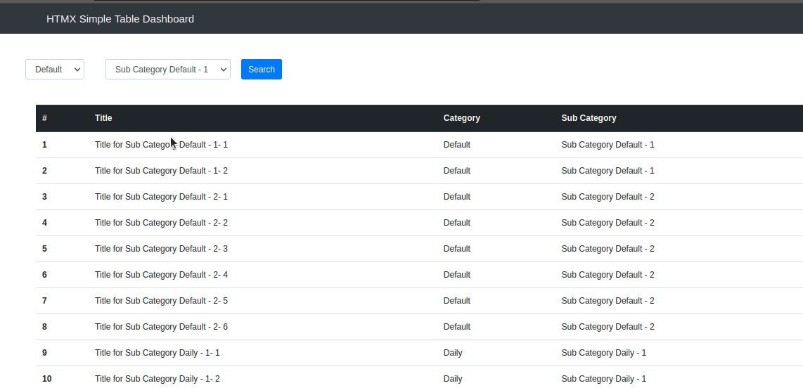

Just trying HTMX with django

If you using pipenv
```
pipenv install
```
or
```
pip install -r requirements.txt
```

Run django as usual

```
python manage.py migrate
python manage.py runserver
```

